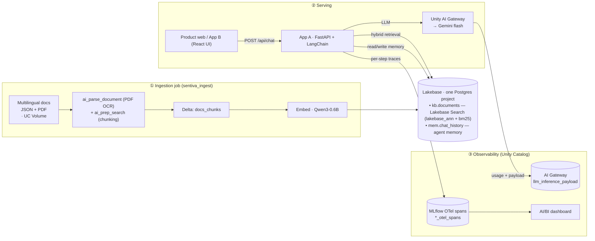

# Sentiva RAG Agent — Databricks end-to-end demo

A complete, deployable Retrieval-Augmented-Generation agent on Databricks for a fictional
consumer digital-safety brand ("Sentiva"). It answers end-customer product questions in
multiple languages (EN / JA / FR / DE) and exposes an HTTP endpoint that a product website
(or any client) can call.

Everything deploys via **Declarative Automation Bundles (DABs)** and tears down cleanly.
Change one file (`config.env`) to target a different workspace.

## Architecture

Two flows: an **offline ingestion job** builds the knowledge base, and an **online agent**
serves questions. Everything persists in Unity Catalog + Lakebase; every request is traced.



## What it demonstrates

| Area | Detail |
|---|---|
| **Agent** | LangChain + FastAPI, deployed as a Databricks App, with per-request MLflow tracing |
| **Knowledge base** | **Lakebase Search** — `lakebase_vector` (ANN) + `lakebase_text` (BM25) hybrid retrieval |
| **Memory** | Lakebase (Postgres) chat history; multi-turn context |
| **Ingestion job** | generate → load JSON → `ai_parse_document` (PDF OCR) → `ai_prep_search` chunking → embed → Lakebase + build indexes |
| **Embedding** | `databricks-qwen3-embedding-0-6b` (1024-dim, multilingual) |
| **LLM** | Databricks-hosted Gemini flash, fronted by **Unity AI Gateway** (usage tracking + inference tables) |
| **Web UI** | React app with multilingual quick-question cards + a Developer panel (copy runnable curl / token) |
| **Observability** | MLflow 3 traces in **OpenTelemetry format inside Unity Catalog** + an AI/BI dashboard |
| **Ops** | DAB deploy, non-destructive preflight checks, one-click test suite, clean teardown |

## API

The agent runs as **App A** (`sentiva-agent-api`) and exposes:

### `POST /api/chat`
Request:
```json
{ "session_id": "any-conversation-id", "message": "How much does Sentiva Shield cost?" }
```
Response:
```json
{
  "answer": "…answer in the question's language…",
  "sources": [{ "title": "…", "source_uri": "…", "product": "Sentiva Shield", "lang": "en" }],
  "timings": { "retrieval_ms": 120, "llm_ms": 640, "total_ms": 780 },
  "trace_id": "…"
}
```
Pass the same `session_id` across turns to keep memory. Authenticate with a workspace
bearer token (`Authorization: Bearer <token>`).

### `GET /api/health` → `{ "status": "ok" }`

**App B** (`sentiva-web`, React UI) proxies to App A and adds helper endpoints:
`GET /api/info` (agent URL) and `GET /api/token` (a short-lived bearer token for the
Developer panel's copy-to-clipboard). App B also exposes the same `/api/chat` via its proxy.

## Repo layout

```
databricks.yml            DAB bundle (jobs / apps / dashboard / schema / volume)
config.env.example        the single per-environment config (copy to config.env)
resources/                DAB resource definitions
scripts/                  preflight, bootstrap, deploy, grants, teardown, test_all
src/app_agent/            App A — LangChain + FastAPI agent
src/app_ui/               App B — React UI + FastAPI proxy
src/jobs/ + src/data_gen/ ingestion pipeline + synthetic multilingual doc generators
dashboards/               AI/BI dashboard definition
tests/                    pytest end-to-end suite (13 checks)
docs/                     DEPLOYMENT.md · DEMO.md
```

## Deploy / run / test

See **[docs/DEPLOYMENT.md](docs/DEPLOYMENT.md)** for the full, ordered steps (including the two
manual UI toggles in its Prerequisites) and **[docs/DEMO.md](docs/DEMO.md)** for the demo
walkthrough (UI, API, tracing, dashboard).

TL;DR: `./scripts/setup_config.sh` (interactive; fills `config.env`) → `source config.env` → follow docs/DEPLOYMENT.md
(`preflight → bootstrap → [UI] → bootstrap_search → build UI → deploy → [UI] → run ingest`)
→ verify with `./scripts/test_all.sh`.

## Notes

- "Sentiva" and all documents are **synthetic demo content**.
- Requires a Unity Catalog workspace with a **serverless SQL warehouse** (serverless
  environment v3+ / DBR 17.3+) and Lakebase (Postgres Autoscaling). The AI functions
  `ai_parse_document` / `ai_prep_search` are only available in certain regions — check
  Databricks' [AI function region availability](https://www.databricks.com/resources/feature-region-support) for your workspace.
- No secrets are stored in the repo; short-lived tokens are fetched at runtime.
